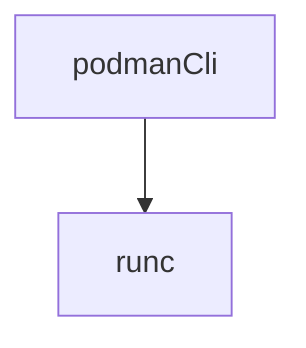

#### 前言   
容器发展了这么多年  一直在更新变化 也出现了 k8s这种庞然大物 
大多数时候用容器 都是用docker  
但是docker本身太过于庞大 包含了运行期间不需要的组件  而且也不是直接调用runc 中间还有自己的daemon  
k8s在1.20之后放弃了对docker shim维护      
#### docker podman containerd 大致功能示例   
> 2017 年， Docker 将自身从 v1.11 起开始引入的容器运行时 containerd捐给了 CNCF

参考文档: 
https://blog.csdn.net/alex_yangchuansheng/article/details/102618128
https://podman.io/getting-started/
https://www.cnblogs.com/sparkdev/p/9063042.html
https://developers.redhat.com/blog/2019/02/21/podman-and-buildah-for-docker-users/
https://zhuanlan.zhihu.com/p/77373246
https://mritd.com/2020/03/31/how-to-download-docker-image-without-docker/

##### docker工作流程简单描述
```shell
yay -Syyu docker 
sudo docker --help 
```

* docker是通过daemon来管理容器的构建运行


* docker启动容器的流程:
docker cli（docker daemon） -> docker engine -> containerd -> docker shim ->runc     


##### podman工作流程简单描述  
```shell
yay -Syyu podman 
podman --help   
```

* podman 比docker简单粗暴多了  直接使用runc搞定 
简单来说   docker功能较为复杂 对runc包装 并且还提供了很多其他功能  podman 直接操控runc  类似直接在操作系统上直接fork进程


* podman 启动容器流程: 



>Podman 不需要启动或管理像 Docker daemon 那样的守护进程。
>适用于 Docker 的命令在 Podman 中也是同样可用的。您可以指定命令别名：alias docker=podman
>Podman 和 Docker 的镜像具有兼容性。
>podman 可以非root用户启动容器 
>就是一句话  docker能做到的 podman基本能做到   而且有些docker中的痛点 如root权限问题  daemon等等 podman也避开了               

##### containerd
基于docker 提供cncf的 容器运行组件   
k8s中主要就是通过containerd来管理容器       
containerd 没有提供跟docker podman一样 构建推送管理镜像的功能 只包含其中的 容器运行功能  
```shell
#安装
yay -Syyu containerd  
containerd --help     
ctr 
```

#### podman buildah skopeo 组合  

Buildah构建容器，Podman运行容器，Skopeo传输容器镜像。这些通过在Github容器组织维护和开源。套件下的工具都无需运行守护进程，并且大多数情况下也不需要root访问权限。
Podman和Buildah之间的一个主要区别是他们的容器概念。 Podman可允许用户创建"传统容器"。Buildah容器作用是给容器添加一些特有的内容而构建容器，Buildah容器是过程容器，编译完成就消失，不能用来跑服务 。简而言之，buildah run命令模拟Dockerfile中的RUN命令，而podman run命令则模拟功能中的docker run命令。
总之，Buildah是创建OCI镜像的有效方式，而Podman允许我们使用熟悉的容器cli命令在生产环境中管理和维护这些镜像和容器。

* podman 管理容器包含构建、运行、推送等等功能     
* buildah 构建镜像功能   非root账户可执行   兼容dockerfile 也可以使用buildah的特有的语法     
* skopeo  推送 拉取镜像功能     

一般来说 只用podman 就够了        
如果需要在非root账户下构建 安装个buildah即可   
skopeo 主要是用来管理镜像的分发的 不管是push 还是pull还是copy 一些特殊的情况  可以用这个工具管理   

#### 总结
总的来说  这些各种容器工具 都是遵循oci标准的 
只是各有各的玩法    
例如在k8s中 肯定是containerd更加适合 因为它只跟容器运行有关     
个人使用 或者是cicd中使用  podman和docker差不多  podman会简单点   而且避开了 docker的痛点   
不管是啥工具 其实最终都是交给runc来启动容器        
我个人来说 我比较看好 podman 和containerd  因为简单粗暴 没有daemon进程 而且可以非root 用户运行  
后面有时间 专门对podman buildah  skopeo的使用记录一下      


