### 前言 
经常要绘制流程图、时序图来做一些讲解和演示 
但是绘制简单的图使用比较专业的工具略显麻烦  而且经常需要调整样式  
看到markdown 有插件也支持绘图 干脆记录一下做个笔记 

### 安装识别绘图插件 
>使用mermaid来进行绘制 官方文档:https://mermaid-js.github.io/mermaid/#/

mermaid支持 流程图、序列图、类图、状态图、实体关系图、用户旅程图、甘特图、指令图、饼图等 具体的查看官方文档   

此处由于个人博客使用hexo来构建 next主题       
如果在其他平台使用 按需安装 mermaid创建即可 例如在vscode 或者idea 上编辑要安装markdown 对应的mermaid插件   
#### hexo

>参考博客: https://blog.csdn.net/wzh0709zml/article/details/103310405

* 安装mermaid插件
```shell script
npm install --save hexo-filter-mermaid-diagrams
```
* 启用绘图      
编辑 blog/themes/next/_config.yaml 中的mermaid配置      
```yaml
# Mermaid tag
mermaid:
  enable: true
  # Available themes: default | dark | forest | neutral
  #绘图主题 按需选择 我个人使用的是default主题  
  theme: default
```
#### vscode    
安装 \[Markdown Preview Mermaid Support] 或者类似插件即可     
#### idea     
idea 上mermaid 插件收费 这里不做演示  mmp 

### 绘图语法示例   
此处全部参考 mermaid语法    参考官方文档即可 这里只作为速查    
#### 流程图

##### 流程图方向 
###### TB - 从上到下
```text
graph TB
   start --> stop
```
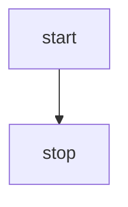

###### TD - 自上而下/与从上到下相同
```text
graph TD
    start --> stop
```


###### BT - 从下到上
```text
graph BT 
    start --> stop 
```
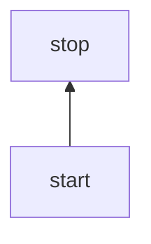

###### RL - 从右到左
```text
graph RL 
    start --> stop 
```


###### LR - 从左到右
```text
graph LR 
    start --> stop 
```


##### 节点形状
###### 默认形状 
```text
graph  LR 
   id1[节点中的内容]
```


###### 圆边节点
```text
graph  LR
    id1(节点中的内容)
```


###### 体育场形状节点
```text
graph  LR
    id1([节点中的内容])
```


###### 子例程形状中的节点 
```text
graph  LR
    id1[[节点中的内容]]
```


###### 圆柱型节点
```text
graph  LR
    id1[(节点中的内容)]
```
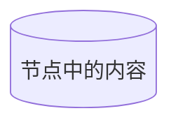

###### 圆形节点
```text
graph  LR 
    id1((节点中的内容))
```
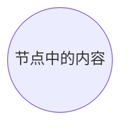

###### 不对称形状节点 
```text
graph  LR
    id1>节点中的内容]
```


###### 菱形节点 
```text
graph  LR 
    id1{节点中的内容}
```
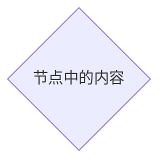

###### 六边形节点
```text
graph  LR
    id1{{节点中的内容}}
```
> 在hexo中 要注意对于‘}}’解析有bug  需要
```text

  包含‘}}’内容

```





###### 平行四边形
```text
graph  LR 
    id1[/节点中的内容/]
    id2[\节点中的内容\]
```
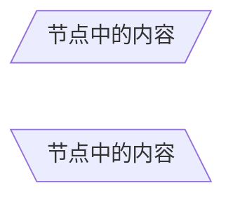

###### 梯形
```text
graph  LR
    id1[/节点中的内容\]
    id2[\节点中的内容/]
```
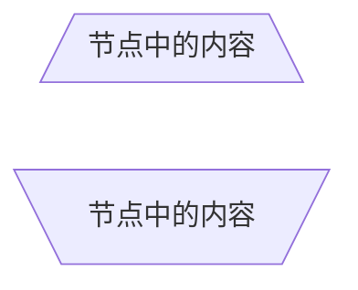

##### 节点之间链接
> 注意-数量

###### 带箭头的链接
```text 
graph  LR 
    a--->B
```
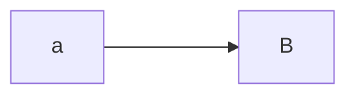

###### 不带箭头的链接
```text
graph  LR 
    a---b
```
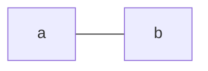

###### 带文本不带箭头链接
```text
graph  LR 
    a--链接内容---b---|链接内容|c
```
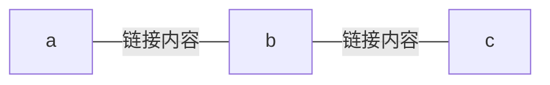

###### 带箭头和文本的链接 
```text
graph LR 
    a--链接内容-->b-->|链接内容|c
```
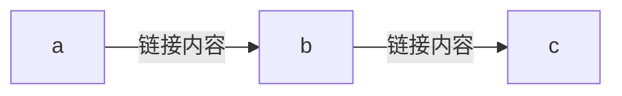

###### 虚线带箭头 点链接
```text
graph LR
    a-.->b-.链接内容.->c
```
```mermaid
graph LR
    a-.->b-.链接内容.->c
```

###### 粗线链接 厚链接
```text
graph LR
    a==>b==链接内容==>c
```
```mermaid
graph LR
    a==>b==链接内容==>c
```

###### 多个链接链接
>  用 & 来指向多个节点   

```text
graph LR
    a--->b--->
    c & d --->e & f
```
```mermaid
graph LR
    a--->b--->
    c & d --->e & f
```

###### 新箭头 （hexo无法解析）
```text
flowchart LR
    A --o B
    B --x C
```
###### 多方向箭头  （hexo无法解析）
```text
flowchart LR
    A o--o B
    B <--> C
    C x--x D
```

> 流程图中的每个节点最终都分配给渲染图形中的等级，即根据其链接的节点指定垂直或水平级别（取决于流程图方向）。默认情况下，链接可以跨越任何数量的排名，但您可以通过在链接定义中添加额外的破折号来要求任何链接比其他链接长。


> 如果有特殊字符 可以用""包含起来  或者使用转义字符替换  

##### 子图
>格式
>subgraph 名称
>    graph definition
>end
>

```text
graph TB
    c1-->a2
    subgraph one
    a1-->a2
    end
    subgraph two
    b1-->b2
    end
    subgraph three
    c1-->c2
    end
```
#### 序列图 时序图
主要是参与者、操作

```text
sequenceDiagram 
    participant a as ming1 
    participant b as ming2
    a->>b:ming2 你好吗?
    b->>a:很好~
```
```mermaid
sequenceDiagram 
    participant a as ming1 
    participant b as ming2
    a->>b:ming2 你好吗?
    b->>a:很好~
```

##### 消息格式
> \[参与者]\[箭头]\[参与者]:消息内容

* 支持六种格式的箭头:

|类型|描述|
|:--|:---|
|->|无箭头的实线|
|[>|无箭头的虚线|
|-»|带箭头的实线|
|–»|带箭头的虚线|
|-x|端端有十字的实线（异步）|
|+x|末尾有十字的虚线（异步）|

##### 激活、停用参与者  定义参与者执行动作块
activate 开启动作   deactivate结束动作    
```text
sequenceDiagram
      participant a as ming1 
      participant b as ming2
      a->>b:ming2 你好
      activate b
      b->>a:很好~
      deactivate b
``` 
```mermaid
sequenceDiagram
      participant a as ming1 
      participant b as ming2
      a->>b:ming2 你好
      activate b
      b->>a:很好~
      deactivate b
```

##### 注释

>note \[right、left、over] 参与者:笔记内容

```text
sequenceDiagram 
    participant ming1
    participant ming2
    note right of ming1:ming1用户
    note over ming1,ming2:ming所有用户
```
```mermaid
sequenceDiagram 
    participant ming1
    participant ming2
    note right of ming1:ming1用户
    note over ming1,ming2:ming所有用户
```

##### 循环

>loop 条件
>   操作
>end

```text
sequenceDiagram
    ming1->>ming2:你好ming2
    loop 现在几点了？
        ming2->>ming1:不知道~
    end
```
```mermaid
sequenceDiagram
    ming1->>ming2:你好ming2
    loop 现在几点了？
        ming2->>ming1:不知道~
    end
```

##### alt 多条件操作
>alt 条件
>   操作
>else 条件
>   操作
>end
>opt 可选序列 
>   操作
>end 

```text
sequenceDiagram
    ming1->>ming2:你好
    alt 好
        ming2->>ming1:好
    else 不好
        ming2->>ming1:不好
    end
    opt 不知道好不好
        ming2->>ming1:不知道好不好
    end
```
```mermaid
sequenceDiagram
    ming1->>ming2:你好
    alt 好
        ming2->>ming1:好
    else 不好
        ming2->>ming1:不好
    end
    opt 不知道好不好
        ming2->>ming1:不知道好不好
    end
```

##### 并行  同时操作 
>par \[操作 1]
>... 操作内容 ...
>and \[操作 2]
>... 操作内容 ...
>and \[操作 N]
>... 操作内容 ...
>end

```text
sequenceDiagram
    participant a as ming1 
    participant b as ming2 
    participant c as ming3 
    par 对ming2嘘寒问暖
        a ->> b: 饿吗
    and 对ming3嘘寒问暖
        a ->> c : 饿吗
    end
```

```mermaid
sequenceDiagram
    participant a as ming1 
    participant b as ming2 
    participant c as ming3 
    par 对ming2嘘寒问暖
        a ->> b : 饿吗
    and 对ming3嘘寒问暖
        a ->> c : 饿吗
    end
```


##### 添加背景颜色 
>rect rgb(x,x,x)
>...
>end 
>
>rect rgba(x.x.x.x)
>...
>end

```text
sequenceDiagram
    rect rgb(0,255,0)
        a->>b:好吗？
    end
```

```mermaid
sequenceDiagram
    rect rgb(0,255,0)
        a->>b:好吗？
    end
```


##### 注释 和 序号 
> %% 注释一行 
> autonumber开启自动编号 
> \<script>
>   mermaid.initialize({
>     sequence: { showSequenceNumbers: true },
>   });
> </script>
```text
sequenceDiagram
    autonumber
    a->>b:好吗？
    %% a->>c:怎么样?
    b->>a:很好 
```
```mermaid
sequenceDiagram
    autonumber
    a->>b:好吗？
    %% a->>c:怎么样?
    b->>a:很好 
```

>  类图 状态图 实体关系图 用户旅程图 甘特图 指令图 饼图 不常用这里不做记录 需要的话直接去官网:https://mermaid-js.github.io/mermaid/#/

### 总结   
mermaid 提供了一种markdown语法来描述常用的图 
对于我来说 可能就流程图 和 时序图比较有用   
至于其他的 用到的时候再说吧
