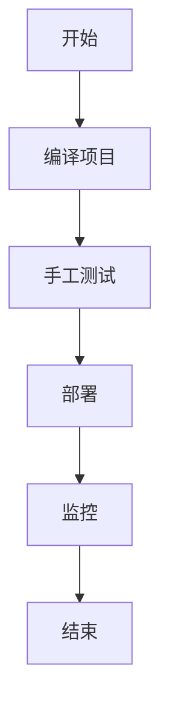
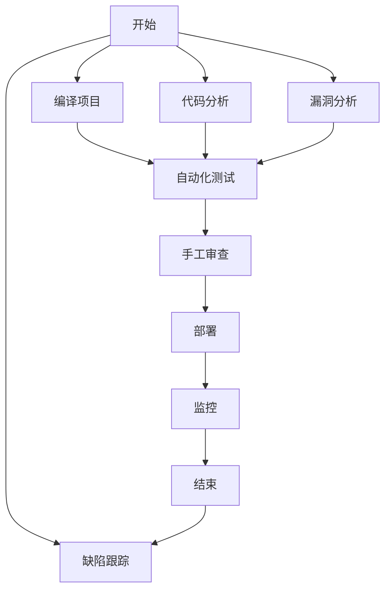
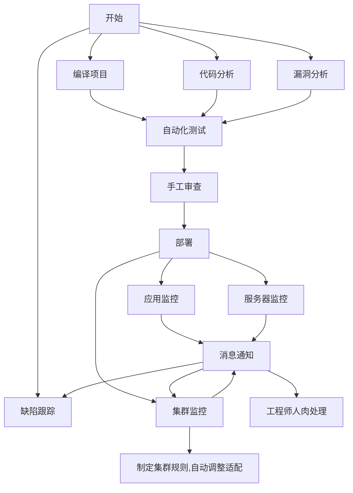
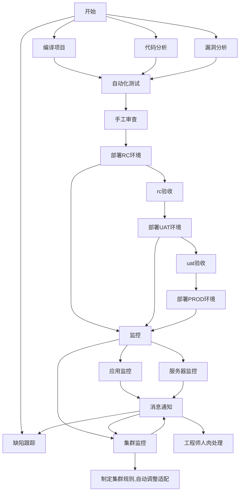

#### 前言 
devops(Development+Operations) 的基础概念:https://www.cnblogs.com/anliven/p/9136624.html   
对于研发来说  就是掌控从代码编写 到实际产出的全流程，更多的是涉及到devops中的持续集成相关部分  从代码产出到测试到部署到监控维护等        
我一直认为 只有自己才是最了解自己写的代码  才能使用最快的方式将代码转化为实际生产力      

#### 基本流程 
##### 第一阶段:加快服务更新速度 

这个阶段 主要是加快从写代码到实际产出的速度  通过增加相关工具达到快速部署            
    

#####  第二阶段:保证服务质量   

这个阶段主要是增加 缺陷跟踪 和 代码分析 和人工审查来增加服务质量          

##### 第三阶段:保证服务可用性 

这个阶段 是增加不同维度监控 和对应的自动适配规则和及时通知进行人肉修复 来增加服务可用性 稳定性  

#### 常规流程 
此处从代码提交 到 各个阶段 最终到测试的常规流程   
> 一般 分为三个到四个环境即可  如 dev-->uat-->prod   dev-->rc-->uat-->prod

#### 总结 
在devops实践中   对于研发来说 主要是掌控从代码到生产的整体流程        
基本上就是 编译 分析 测试 部署 监控            
这里只大概记录一下 基本流程    真实使用 比这个复杂太多了    
要考虑 团队人员情况、领导支持程度、资源分配多寡等等问题    
相对来说这种东西短期效果并不明显 需要一定的时间才能有效果    
市面上各种工具倒是齐全 更多的是要获取技术之外的支持 才能更好的去实践devops  
